## 8.25 Animelo Summer Live 2023 - AXEL - Day 1

从高中趴在宿舍上铺床上看Animelo Summer Live的切片以来，参战ASL就是我最大的一个梦想。所以这一次，有幸抽到了ASL Day 1的VIP席后，我立马定了机票请好假。考虑到在疫情之后这是ASL第一次可以出声应援，因此我十分期待。

8月25号上午我飞到日本，到家已经是十一点。从东京市内到ASL会场埼玉Super Arena需要大约一小时时间，因此我先按惯例吃了一碗（过多的）武道家拉面，以（胃）非常饱满的状态启程前往埼玉。

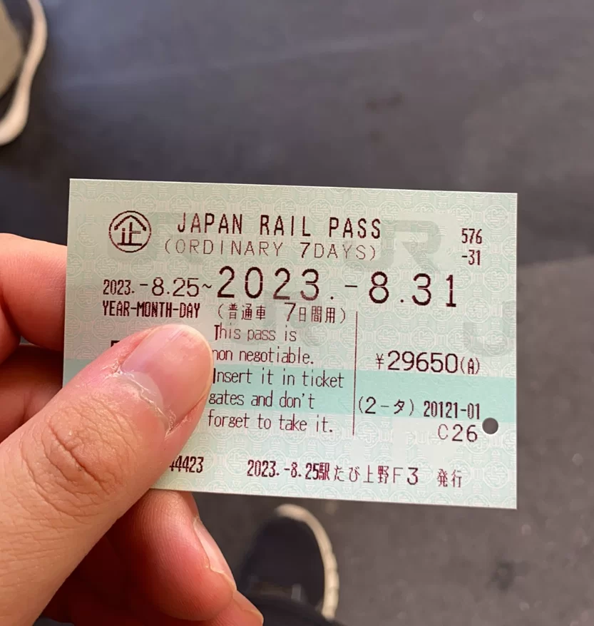

顺路去上野换了JR PASS，后面帮了大忙，此处先按下不表

ASL的票面写的是2点开场，4点开演，我到会场外的时间大概是2点半左右。会场外面是各种展台，扭蛋机和场贩。

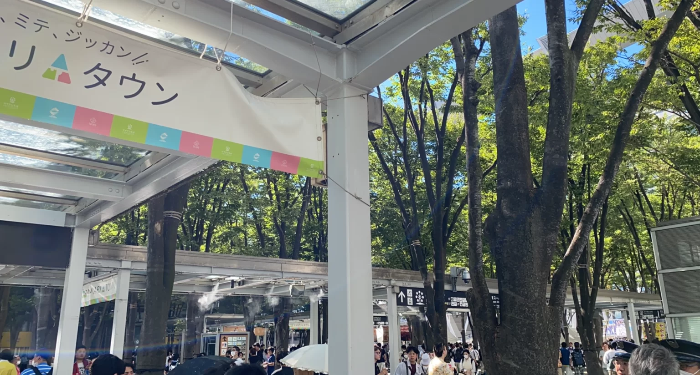

感受一下什么叫人潮汹涌

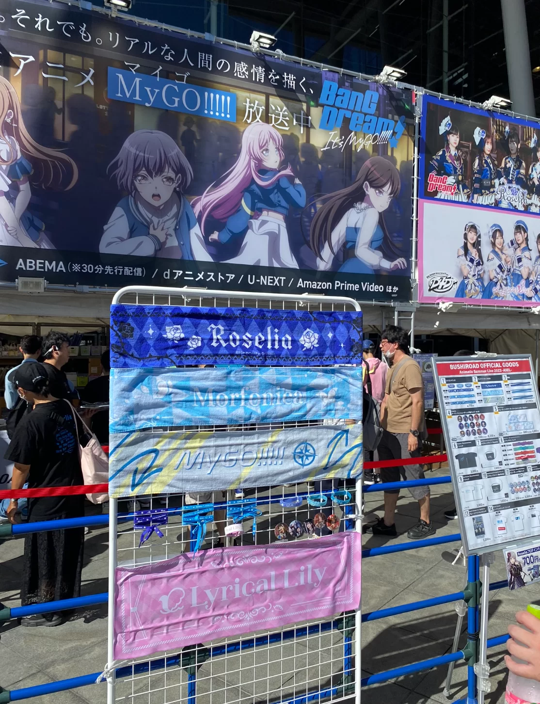

BangDream的展台，还有没有看BangDream It's MyGO!!!!!的伙伴吗？快去看！！！

说实话，会场外面真是太热了，太阳直射下八月的东京体感上比赤道的新加坡热上一百倍。

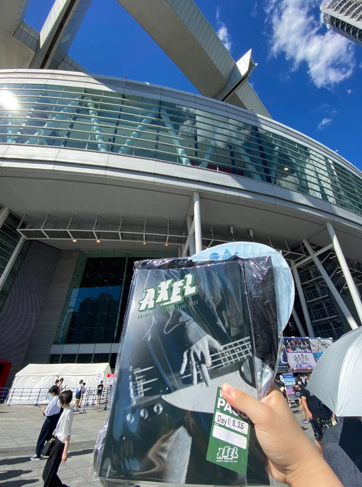

以及，作为睾贵的VIP票holder，当然不能少了VIP特典（T恤和场刊一份）！

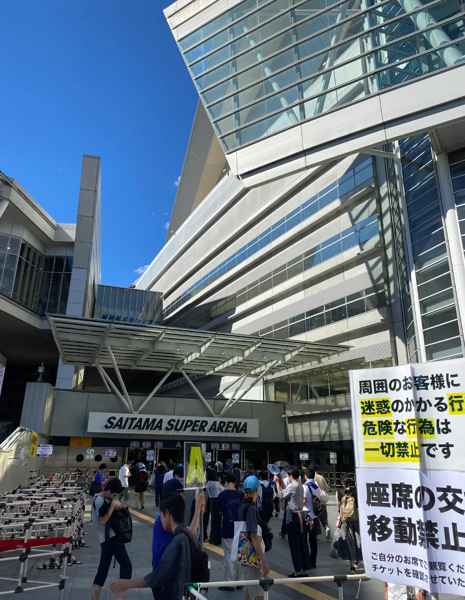

此处乃是阿宅们的圣地，埼玉Super Arena！！

由于实在是受不了这样的天气，我简单拍了两张照片就去入场口了。刚进会场内部空调很足，但可能是由于VIP席都在靠近舞台的位置，所以空调并没有看台上那么凉爽。

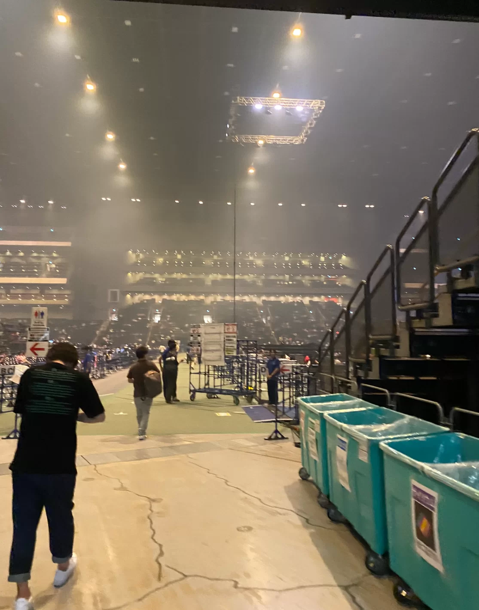

踏入场馆，仿佛踏入圣殿.....太激动了！从这条通道出去，右手边正对着就是主舞台

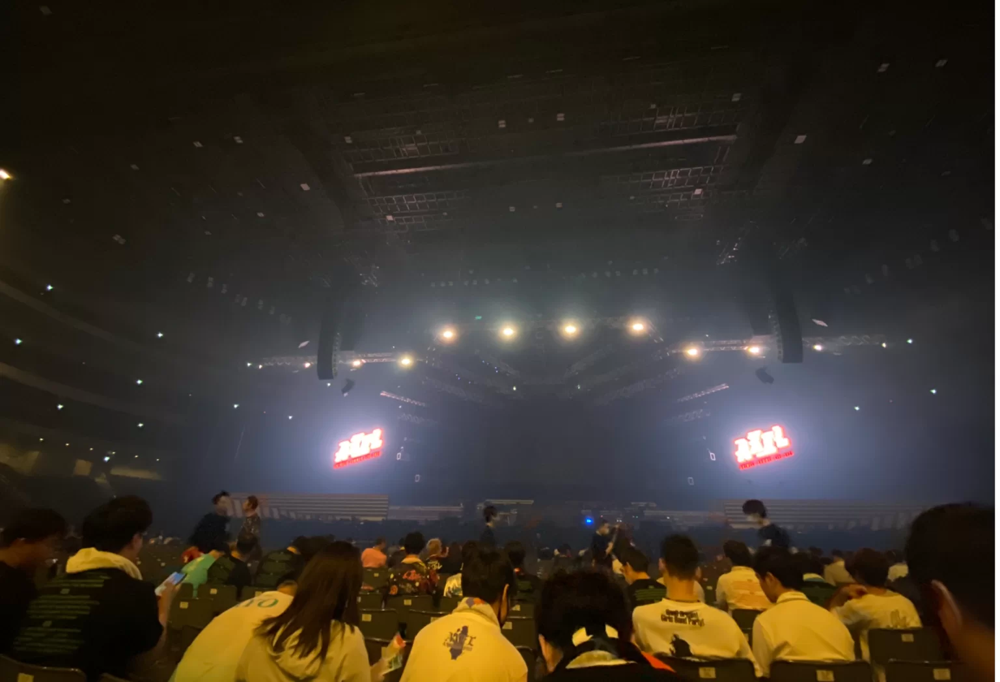

我的Day1坐席视角，舞台看得非常清楚

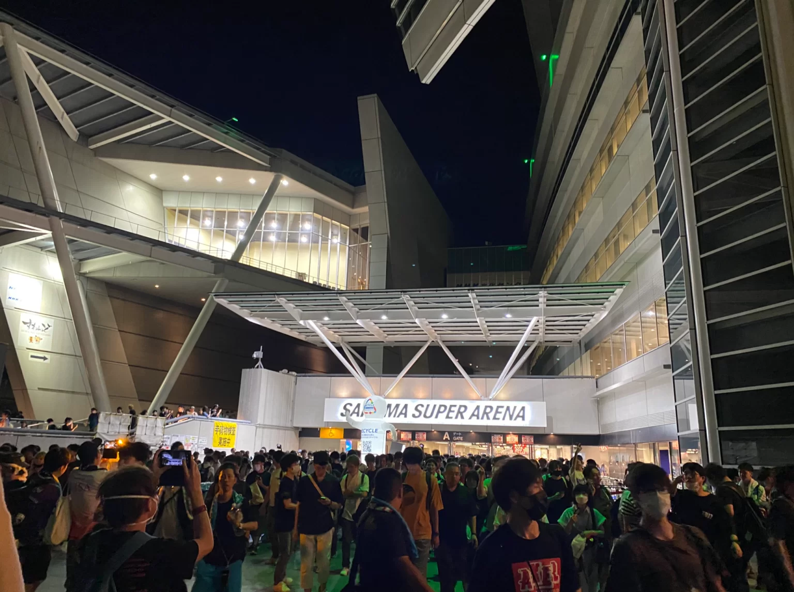

散场后的场馆正门口，非常恐怖的人流

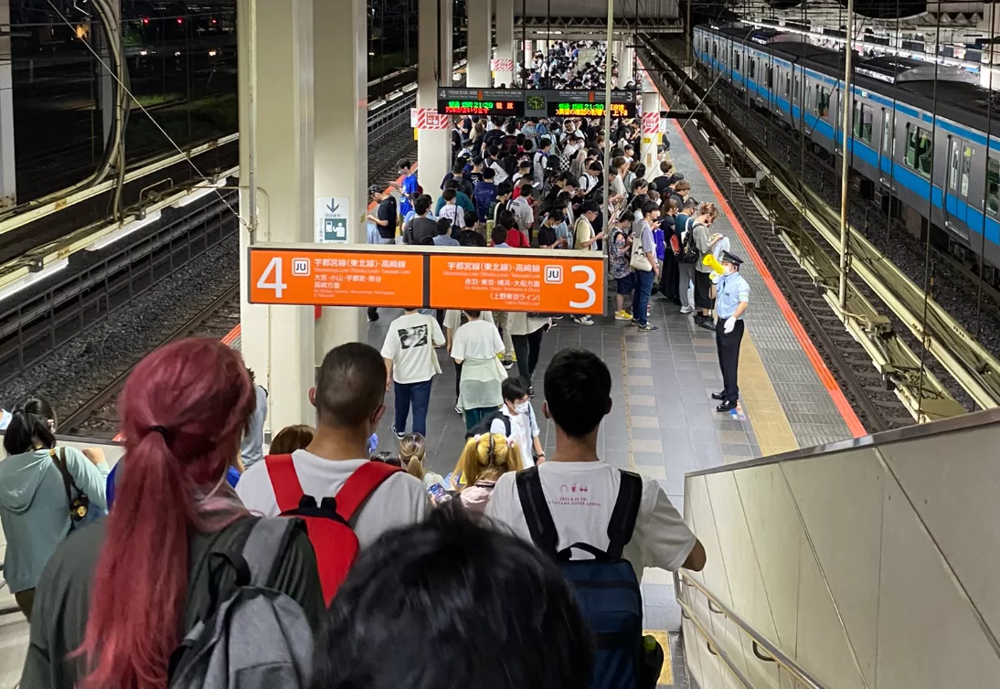

JR埼玉新都心站的月台，往东京方向的月台挤满了人

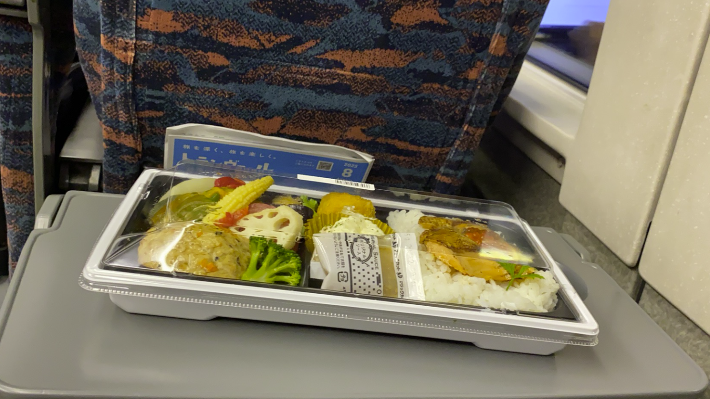

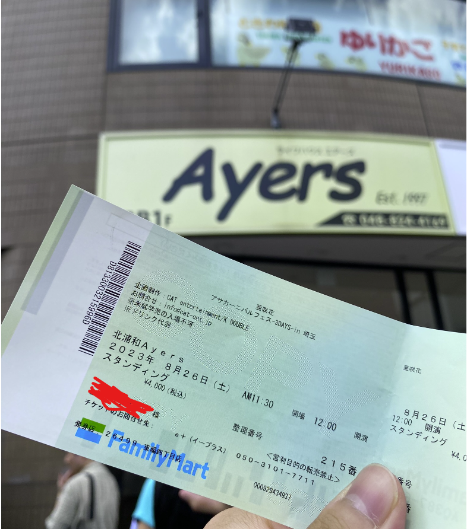

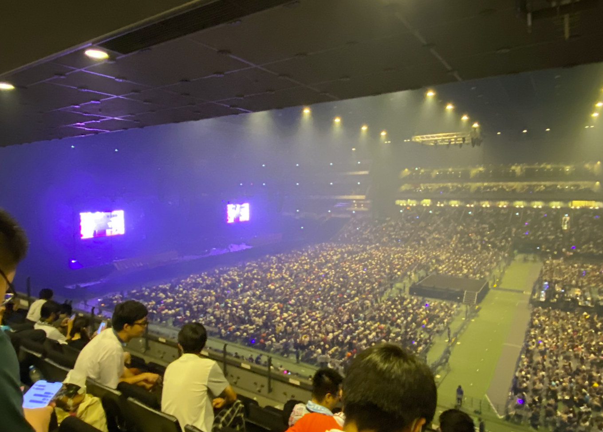

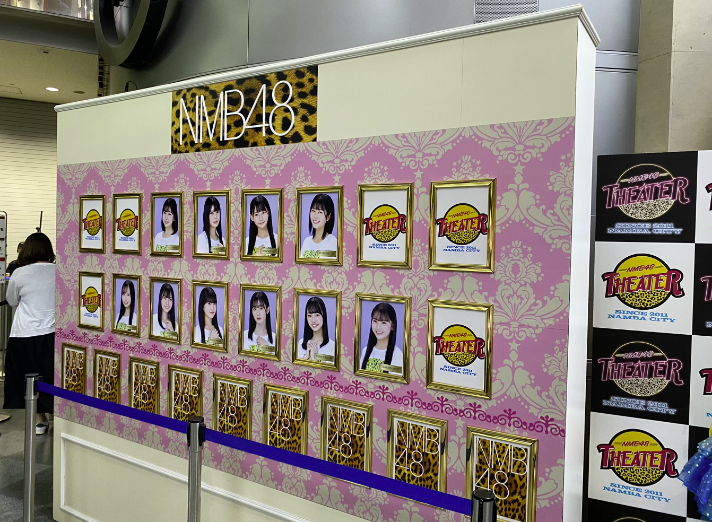